# 傅里叶变换学习笔记
目录
<!-- vscode-markdown-toc -->
* 1. [离散傅里叶变换](#)
* 2. [傅里叶变换画图](#-1)
* 3. [标题3](#3)

<!-- vscode-markdown-toc-config
	numbering=true
	autoSave=true
	/vscode-markdown-toc-config -->
<!-- /vscode-markdown-toc -->


##  1. <a name=''></a>离散傅里叶变换

创建时间 _2023 年 10 月 18 日_

_纸上得来终觉浅，觉知此事要躬行，想搞懂离散傅里叶变换，最好是自己做一遍，回想起来，从来没有真正手算过傅里叶变换_

本文只求理解，会用，不追求严谨的推导

---

离散傅里叶变换的公式，傅里叶变换后得到的 $X[k]$ 为

$$
X[k]=\sum_{n=0}^{N-1}{x[n]e^{-j2\pi k (n/N)}},(0\leq k \leq N-1)
$$

离散傅里叶**反**变换的公式，原信号 $x(t)$ 的采样信号 $x[n]$ 可以表示为

$$
x[n]=\frac{1}{N}\sum_{k=0}^{N-1}{X[k]e^{j2\pi n(k/N)}},(0\leq n \leq N-1)
$$

---

对于 $e^{-j2\pi\frac{k}{N}n}$ ,如果不好理解，就根据欧拉公式 $e^{i\theta}=cos(\theta)+isin(\theta)$ 先拆分一下，（最好是能够理解）

$$
X[k]=   \sum_{n=0}^{N-1}{x[n]cos(-2\pi k\frac{n}{N})}+
        j\sum_{n=0}^{N-1}{x[n]sin(-2\pi k\frac{n}{N})}
        ,(0\leq k \leq N-1)
$$

也就是

$$
X[k]=   \sum_{n=0}^{N-1}{x[n]cos(2\pi k\frac{n}{N})}-
        j\sum_{n=0}^{N-1}{x[n]sin(2\pi k\frac{n}{N})}
        ,(0\leq k \leq N-1)
$$

乍一看没问题，仔细一看，一个实数信号，被转换成了复数信号，反变换试试

$$
x[n]=   \sum_{k=0}^{N-1}{X[k]cos(2\pi n\frac{k}{N})}+
        j\sum_{k=0}^{N-1}{X[k]sin(2\pi n\frac{k}{N})}
        ,(0\leq k \leq N-1)
$$

一个实数信号，傅里叶变换，再变回来，多了个虚部？

不要慌张, $X[k]$ 与 $X[N-k]$ 是共轭的`注意，不是第k个与倒数第k个共轭`,求和出来虚部是会抵消的， $x[n]$ 仍然是实数序列

$$
2\pi n\frac{k}{N}+2\pi n\frac{N-k}{N}=2\pi n
$$

$$
j(a+jb)sin(\theta)+j(a-jb)sin(2\pi-\theta)=-2bsin(\theta)
$$

---

先看 $cos$ 项，对于 $X_{cos}[k]$ ，可以这样理解，在原信号的每个采样点 $x[n]$ 所在的位置，按照某个特定频率的余弦信号也生成一个点（离散化），逐点相乘，再求和，这样可以寻找原始信号 $x[n]$ ，与这个余弦信号 $cos(2\pi\frac{k}{N}n)$ 之间的相关性

因为这个操作有个很奇妙的地方，如果这两个信号不相关， $X_{cos}[k]$ 算出来就是 0

举个例子，假设原信号 $x(t)=cos(4\pi x)$ ,在两个周期内采样 20 个点

$$x[n]=cos(4\pi\times\frac{n}{N})$$

$X[1]$ 计算结果如下, $X_{cos}[1]=0$

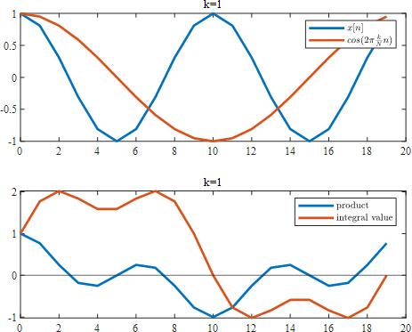

$X[2]$计算结果如下, $X_{cos}[2]=10$

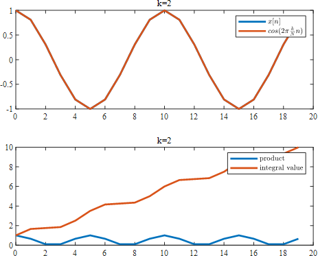

$X[3]$计算结果如下, $X_{cos}[3]=0$

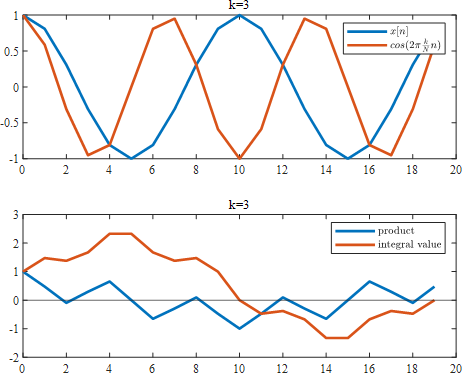

一直到 $X_{cos}[19]$ , $X_{cos}[19]=0$


> 非常奇怪，k=19 与 k=1 的效果是一模一样的,这是因为根据 $cos$ 的对称性 $cos(\theta)=cos(2\pi-\theta)$ $$cos(2\pi\times k\frac{n}{N})=cos(2\pi\times(N-k)\frac{n}{N})$$
> 也可以这么理解，低频信号与高频信号是有交点的， $cos(2\pi\times 1t)$ 与 $cos(2\pi\times 19t)$ 有很多交点，但是离散化之后，又恰巧把离散点取到了这些交点上，无法分辨这些点到底是哪条线上的，这也从另一个角度说明了为啥傅里叶变换是对称的，而且只有前面一半的是有用的，因为 k 取 19 时，无法判断到底时 1 触发的还是 19 触发的，干脆舍弃不用
>
> 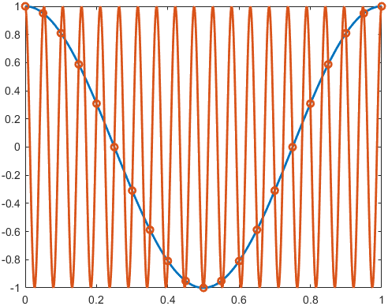

只有当 $x[n]$ 中有此频率成分时， $X_{cos}[k]$ 才不为 0，剩下的，积分算出来全是 0

那么，计算出来的 $X_{cos}[k]$ 的物理含义到底是什么呢？

“ $k$ ”表示第 $k$ 个频率分量，这里，信号频率为 2Hz，采样频率 $f_s$ 为 20Hz，那么 $X_{cos}[k]$ 就对应了 $f=\frac{k}{N}f_s$ 的频率，当 $k=2$ 时， $f=2Hz$
假设采样点数 $N=40$ ，那么对于

$$x[n]=cos(4\pi\times\frac{n}{N})$$

进行变换，则 $X_{cos}[2]=20$ ,对应频率 $f=\frac{2}{40}\times40$

k 对应的频率搞清楚了，那 $X_{cos}[k]$ 的值表示什么呢？此频率分量真正的幅值为“ $\frac{2}{N}X[k]$ ”,对于直流分量“ $\frac{1}{N}X_{cos}[0]$ ”

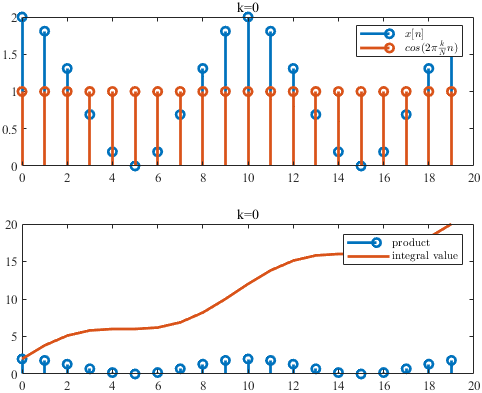

至于“1/N,2/N”是怎么来的，看了有的教程，说太简单就不推导了，资质愚钝，不能理解

那么傅里叶变换中的 $sin(\theta)$ 项又是啥意思呢

假设原始的函数有了相位偏移， $x(t)=cos(4\pi x+\pi/4)$ ,在两个周期内采样 20 个点

$$x[n]=cos(4\pi\times\frac{n}{N}+\frac{\pi}{4})$$

不相关的项 $X[0],X[1],X[3]···$ 依然是 0，对于 $X_{cos}[2],X_{cos}[18]$ 则有了变化

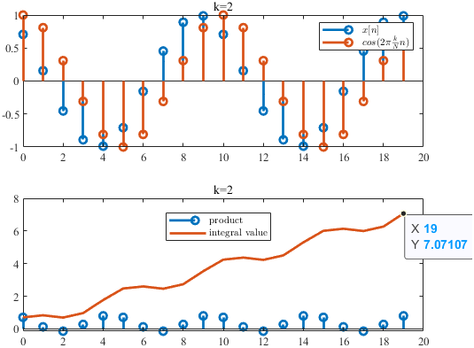

这个图像与原函数为 $x(t)=0.707cos(4\pi x)$ 的效果是一样的，这种情况显然是不好的，无法分辨是本来原函数的幅值只有 0.707，还是因为相位的偏差导致算出来幅值为 0.707
甚至当相位偏了 $\pi/2$ 时

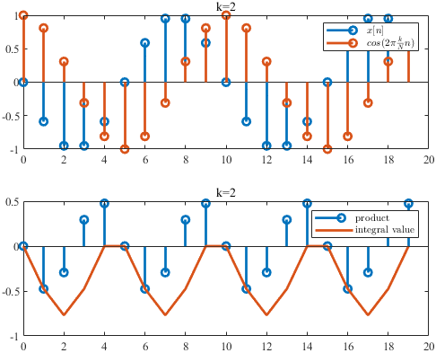

相位偏了 $\pi$ 时

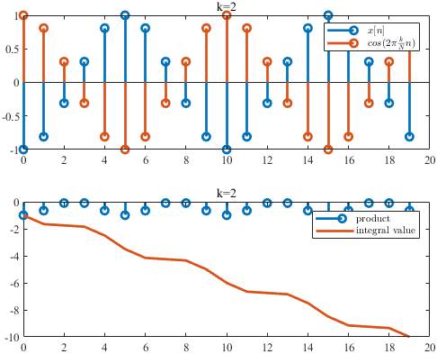

也可以说上述只有 cos 的变换是不完善的，损失了某些信息，这就引入了 sin 项,用 cos 和 i\*sin 的组合，来不失真地进行转换

$X_{sin}[2]=-7.07$

 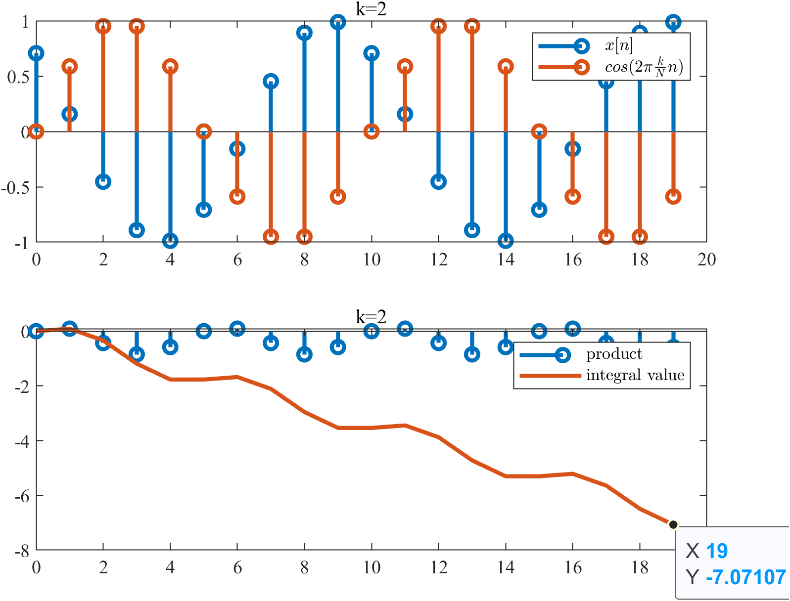

$X_{sin}[18]=7.07$

 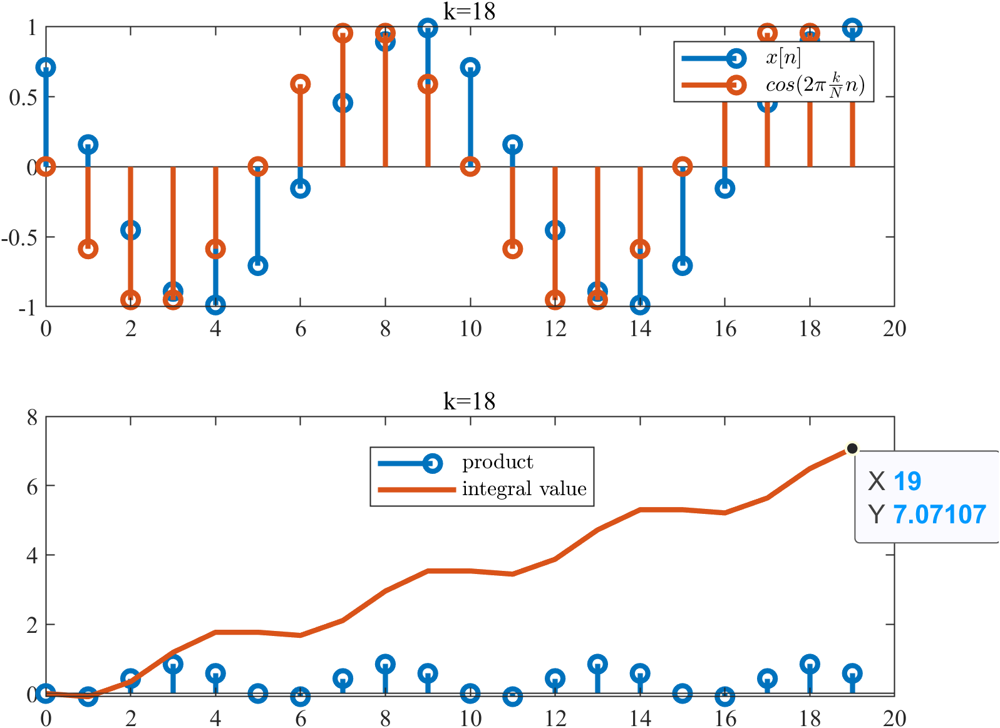

> 注意，这里 $X_{sin}[k]=-X_{sin}[N-k]$ ,也是因为根据 $sin$ 的对称性 $sin(\theta)=sin(2\pi-\theta)$ $$sin(2\pi\times k\frac{n}{N})=-sin(2\pi\times(N-k)\frac{n}{N})$$

这时，cos 项和 sin 项组合起来就能完整地表征原始信号了

幅值

$$X[k]=\sqrt{(X_{cos}[k])^2+(X_{sin}[k])^2}$$

$$X[2]=\sqrt{(X_{cos}[2])^2+(X_{sin}[2])^2}=10$$

相位

$$actan\frac{-(-0.707)}{0.707}=\pi/4$$

---

##  2. <a name='-1'></a>傅里叶变换画图

**_当傅里叶拿起画笔_**

首先画一个简单的爱心
其横纵坐标分别为

```matlab
axis_x = [2 3 4 5 4 3 2 1]';
axis_y = [4 3 4 3 2 1 2 3]';
```

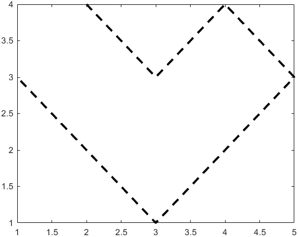

把坐标转换为复数形式

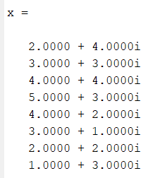

进行离散傅里叶变换

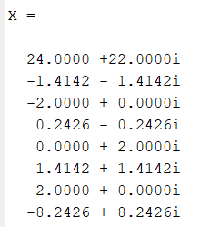

这些复数也可以认为是一些点，不过似乎和原来的点没啥联系

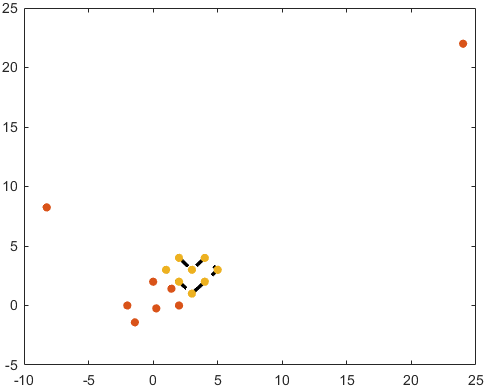

但是根据傅里叶变换的公式，稍加分析就会发现$x[n]$和$X[k]$之间的联系

$$
x_0 = \frac{1}{8}(X_0\cdot e^0 + X_1\cdot e^0 + X_2\cdot e^0 + X_3\cdot e^0 + X_4\cdot e^0 + X_5\cdot e^0 + X_6\cdot e^0 + X_7\cdot e^0)
$$

$$
x_1 = \frac{1}{8}(X_0\cdot e^{0} + X_1\cdot e^{i2\pi/8} + X_2\cdot e^{{i4\pi/8}} + X_3\cdot e^{{i6\pi/8}} + X_4\cdot e^{{i8\pi/8}} + X_5\cdot e^{i10\pi/8} + X_6\cdot e^{i12\pi/8} + X_7\cdot e^{i14\pi/8})
$$

$$
x_n = \frac{1}{N}(X_0\cdot e^{i2\pi n \frac{0}{N}} +X_1\cdot e^{i2\pi n \frac{1}{N}} + X_2\cdot e^{i2\pi n \frac{2}{N}} +  X_3\cdot e^{i2\pi n \frac{3}{N}} + X_4\cdot e^{i2\pi n \frac{4}{N}} + X_5\cdot e^{i2\pi n \frac{5}{N}} + X_6\cdot e^{i2\pi n \frac{6}{N}} + X_7\cdot e^{i2\pi n \frac{7}{N}})
$$

而 $e^{i\theta}$ 相当于绕着圆周旋转

$x_0$ 等于 $X[0],X[1]···X[7]$ 分别旋转 $0/8$ 个 $0·2\pi$ ， $1/8$ 个 $0·2\pi$ ，··· $7/8$ 个 $0·2\pi$ ，求和取平均

$x_2$ 等于 $X[0],X[1]···X[7]$ 分别旋转 $0/8$ 个 $2·2\pi$ ， $1/8$ 个 $2·2\pi$ ，··· $7/8$ 个 $2·2\pi$ ，求和取平均

$x_3$ 等于 $X[0],X[1]···X[7]$ 分别旋转 $0/8$ 个 $3·2\pi$ ， $1/8$ 个 $3·2\pi$ ，··· $7/8$ 个 $3·2\pi$ ，求和取平均

那么傅里叶变换之后的这些矢量平均和的端点，就能够还原原来的图像上的点，这就是为啥傅里叶变化画图是一堆箭头，外面套个圆圈，再绕来绕去

第 0 个点

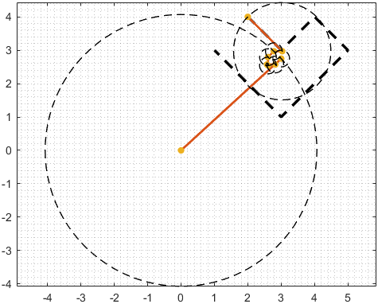

第 1 个点


第 2 个点

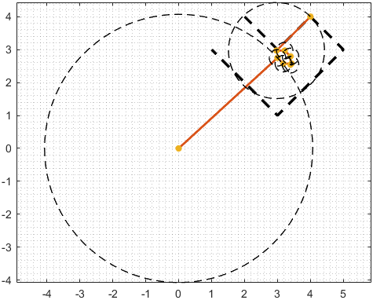

第 7 个点

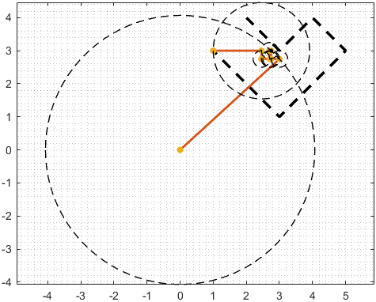

这些矢量我没有按照模值大小排列，按大小排个顺序，就跟网上看到的一样了，把这每一帧连起来播放，就是最终的动画

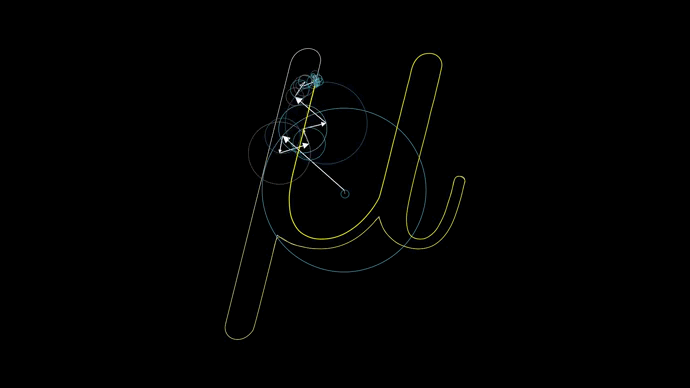


##  3. <a name='3'></a>傅里叶级数

参考与引用

链接: [从傅立叶级数到傅立叶变换](https://www.matongxue.com/madocs/712/)

傅里叶级数的公式为：

$$
f(x)=a_0+\sum_{n=1}^{\infty}{\left(a_{n}cos({\frac{2\pi n}{T}x})+b_{n}sin({\frac{2\pi n}{T}x})\right)},a_0\in\mathbb{R}
$$

让·巴普蒂斯·约瑟夫·傅里叶男爵（1768 －1830）猜测任意周期函数都可以写成三角函数之和

从代数上看，傅立叶级数就是通过三角函数和常数项来叠加逼近周期为 $T$ 的函数 $f(x)$ ：
最低次频率为本身的频率，后面是二次、三次···谐波`疑问：为什么都是基波的整数倍`

这种表达式下，画频谱图不是很方便，因为同一个频率下既有 $sin(x)$ ,也有 $(cos(x))$ ，到底画哪根，搞不清楚`可以根据三角函数公式合并一下，得到幅值和相位`通过欧拉公式，可以变形

$$
f(x)=\sum_{{n=-\infty }}^{\infty }c_{n}\cdot e^{{i{\tfrac {2\pi nx}{T}}}}
$$

<!-- @ import "frqPlot.m" -->
